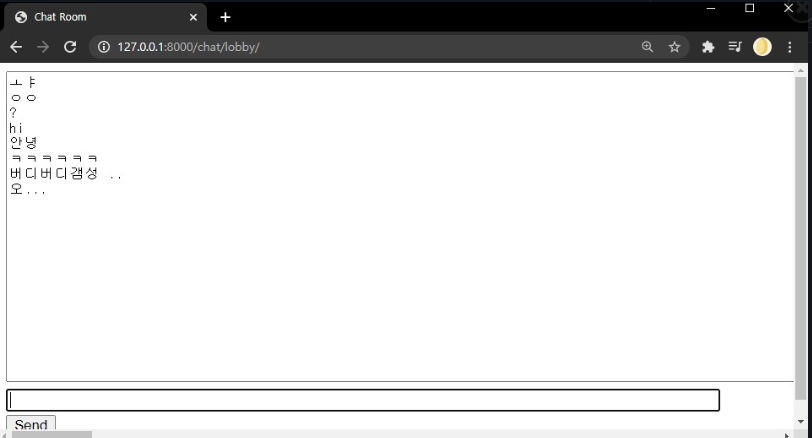

# Channel Chat

> WebSocket을 이용한 실시간 채팅방





## 설치 방법

윈도우:

```

```


## 사용 예제


## 개발 환경 설정


## 업데이트 내역

- 0.0.1
  - 작업 진행 중


## 정보

곽온겸 - [github](https://github.com/AntBean94) | email

조명희 - [github](https://github.com/Jo-Myounghee) | [email](jomyounghee32@gmail.com)